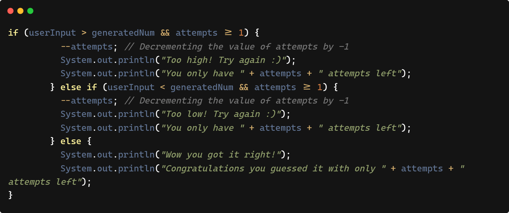
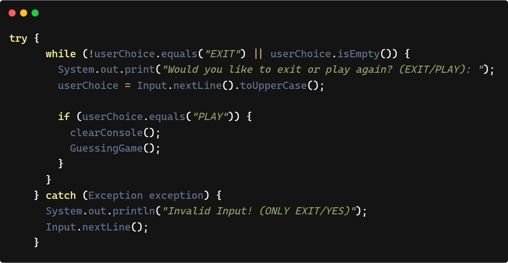
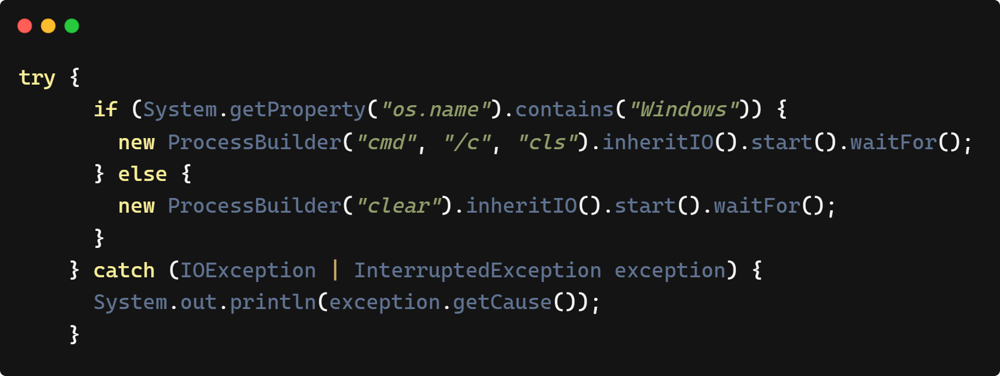

# JAVA PROJECT 101

#### Hi everyone, I'm excited to share my first ever Java project with you. This is part of my journey learning how to code, and it's also a way for me to track my progress as I work on improving myself this year. :blush::blush:

---

## This project is all about guessing the right number that is randomly generated.

> How to run:
> - Just click the .exe file to run the program
> - Its more easy and convenient if you want a preview of the system without opening the source code.

#### Here is the algorithm:
> - Start
> - Generating a random number
> - Asking the user to guess the right number with only 7 attempts
> - Getting the user input
> - Checking if the user's guessed is within the range of the random number
> - If the input is above the range, prompt the user it's too high
> - If the input is below the range, prompt the user it's too low
> - Prompt the user how many attempts left
> - Check if the user got the right random number
> - If true, then prompt the user that they've won, and prompt how many attempts left.
> - If false, then prompt the user that they've lost
> - Ask the user if they want to play again or exit
> - If "play again", run the system back
> - If "exit" close the system
> - End

### Code snippets
---
> Checking the range:
> 
>
> Input error handling:
> 
>
> Method for clearing the console:
> 
>
---
### Follow My Social Links:
>**[Facebook](https://www.facebook.com/Chrstnmmnl):grin:**
>**[Instagram](https://www.instagram.com/chrstnmmnl/):heart_eyes:**
>**[Dribble](https://dribbble.com/chrstnmmnl):open_mouth:**
>**[Linkedin](https://www.linkedin.com/in/chrstnmmnl/?originalSubdomain=php):kissing:**
>**[Youtube](https://www.youtube.com/@chrstnmmnl):sweat_drops:**
